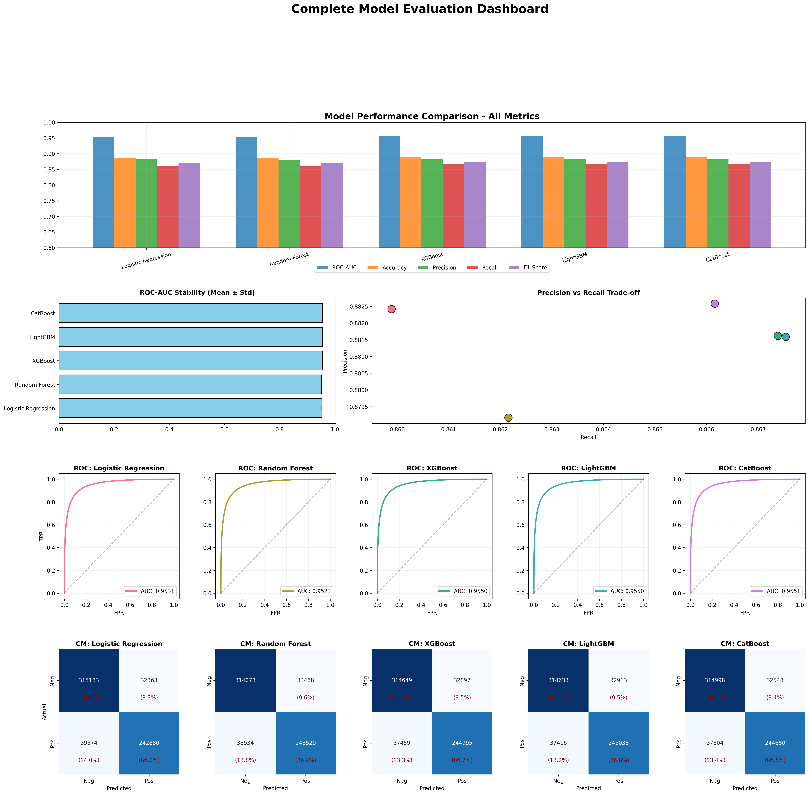
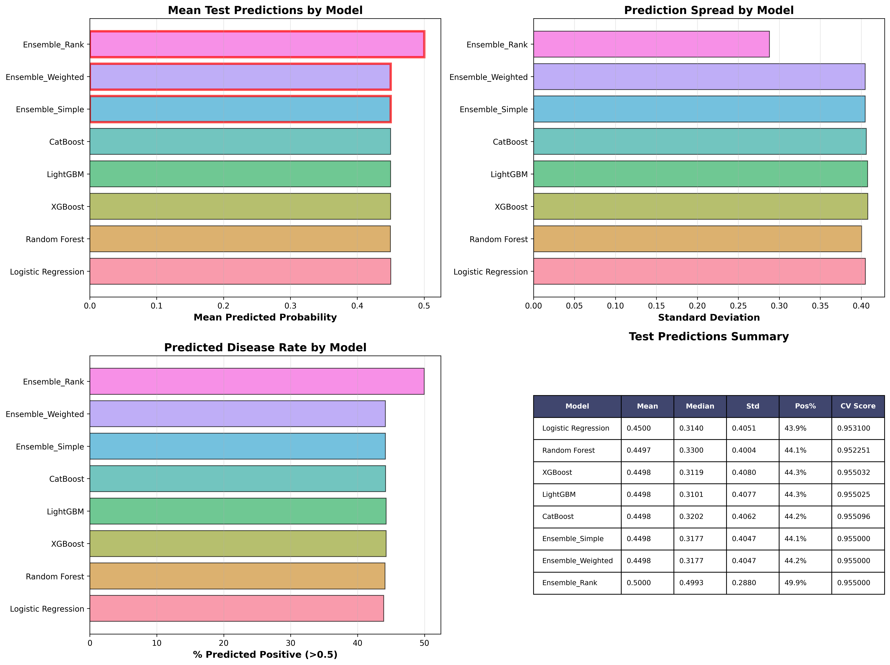

# Heart Disease Prediction — Kaggle Playground Series S6E2

**Competition:** [Playground Series – Season 6, Episode 2](https://www.kaggle.com/competitions/playground-series-s6e2)
**Metric:** ROC-AUC
**Result:** 0.952

## Dataset

| Split | Samples | Features |
|-------|---------|----------|
| Train | 630,000 | 14       |
| Test  | 270,000 | 13       |

**Target:** `Heart Disease` (binary — Absence / Presence)

**Features:**

| Feature | Type |
|---------|------|
| Age | Numerical |
| Sex | Binary |
| Chest pain type | Categorical (1–4) |
| BP | Numerical |
| Cholesterol | Numerical |
| FBS over 120 | Binary |
| EKG results | Categorical |
| Max HR | Numerical |
| Exercise angina | Binary |
| ST depression | Numerical |
| Slope of ST | Categorical |
| Number of vessels fluro | Numerical (0–3) |
| Thallium | Categorical (3, 6, 7) |

## Pipeline

### 1. Exploratory Data Analysis

- Class distribution check
- Histograms and box plots for numerical features
- Bar plots and crosstabs for categorical features
- Violin plots by target class
- T-tests for statistical significance (all numerical features significant at p < 0.05)
- Correlation heatmap
- Pairplots and parallel coordinate plots
- Age-group and risk-factor analysis
- Data quality checks (zeros, negatives, unrealistic values)

### 2. Feature Engineering (9 stages, ~56 engineered features)

| Stage | Description | Count |
|-------|-------------|-------|
| Binary features | Medical threshold flags (age, BP, cholesterol, Max HR, ST depression, vessels, sex, chest pain, EKG, thallium) | 20 |
| Age group binning | 4-bin, 5-bin, and decade bins | 3 |
| Measurement binning | BP, cholesterol, Max HR, ST depression bins | 4 |
| Polynomial features | Age², BP², ST depression² | 3 |
| Ratio features | MaxHR % theoretical, BP/cholesterol, age/MaxHR, ST/MaxHR | 4 |
| Interaction features | Age×, sex×, exercise test×, severity combinations, risk score | 15 |
| Log transforms | log(1 + ST depression), log(1 + vessels) | 2 |
| Aggregated features | Cardiovascular stress index, overall health score | 2 |
| One-hot encoding | Thallium (non-ordinal) | 3 |

### 3. Preprocessing

- Train/test column alignment
- Missing value imputation (median, fitted on train)
- Infinite value replacement
- StandardScaler for linear models (fitted on train, applied to both)
- No scaling for tree-based models

### 4. Models

Five base models trained with 5-fold stratified cross-validation:

| Model | ROC-AUC | Accuracy | Precision | Recall | F1 |
|-------|---------|----------|-----------|--------|----|
| CatBoost | 0.9551 | 0.8883 | 0.8826 | 0.8662 | 0.8743 |
| XGBoost | 0.9550 | 0.8883 | 0.8816 | 0.8674 | 0.8744 |
| LightGBM | 0.9550 | 0.8884 | 0.8816 | 0.8675 | 0.8745 |
| Logistic Regression | 0.9531 | 0.8858 | 0.8824 | 0.8599 | 0.8710 |
| Random Forest | 0.9523 | 0.8851 | 0.8792 | 0.8622 | 0.8706 |

### 5. Ensembles

Three ensemble strategies applied on test predictions:

| Ensemble | Method |
|----------|--------|
| Simple Average | Equal-weight mean of all model probabilities |
| Weighted Average | Weighted by each model's CV ROC-AUC |
| Rank Average | Mean of normalized prediction ranks across models |

## Results

### Model Comparison



### Test Predictions Analysis

.png)

### Test Predictions Summary



## Tech Stack

- Python 3
- NumPy, Pandas
- Matplotlib, Seaborn
- scikit-learn
- XGBoost
- LightGBM
- CatBoost
- SciPy

## Repository Structure

```
├── heart-disease-prediction.ipynb   # Full notebook (EDA → features → models → ensembles → submission)
├── complete_model_comparison.png    # CV metrics comparison across all models
├── test_predictions_analysis (1).png # Prediction distributions and correlations
├── test_predictions_summary.png     # Summary statistics of test predictions
└── README.md
```
